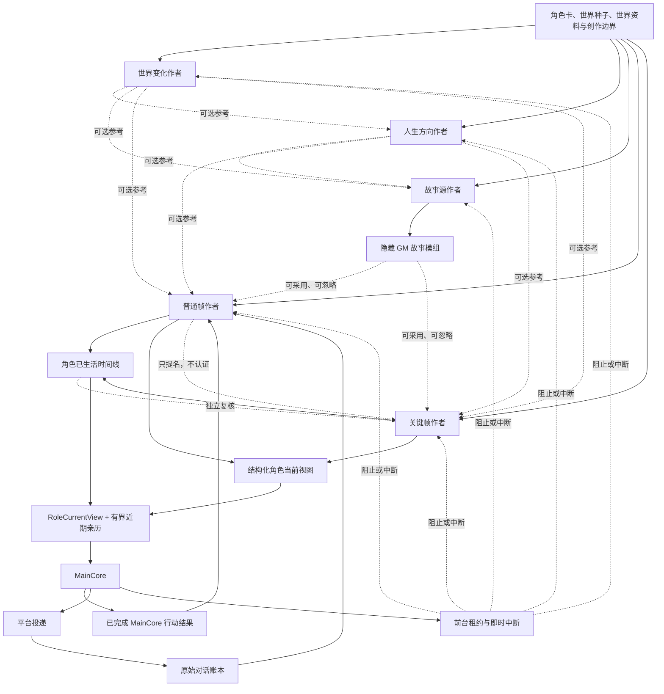

# SoulCore 架构

## 运行边界

SoulCore 以 `profile_id` 表示角色档案，以 `profile_id + instance_id` 表示一条独立聊天世界线。角色卡、用户世界种子、世界资料和创作边界可以在同一角色的实例间共享；聊天、角色生活时间线、五位作者状态、故事模组、调度和当前视图严格按实例隔离。

MainCore、五位背景作者和其他后台能力共享 AI 任务、工作记录、租约、持久唤醒、Outbox 与事件日志基础设施，但不共享业务写权限。MainCore 与五位背景作者还共享一把实例级时间线排他锁：任何前台行动开始前都会阻止并中断同实例背景作者，直到前台完全结束。

## 角色包快照与导入事务

角色包是跨安装传递角色级创作输入的稀疏补丁，不是数据库备份。导出在共享 SQLite 引擎的一次 `BEGIN IMMEDIATE` 快照中读取角色模型、世界定义、世界资料、创作边界与两类立绘记录；随后只读取快照指向的受管图片，逐张复核状态、字节数、SHA-256、格式、像素与动画预算。任一图片缺失、变化或损坏都会停止整次导出。ZIP 条目采用固定顺序、固定时间与权限，内容不含生成时间，因此相同快照和生成器版本产生可复现字节。

导入分为“完整接纳与预览”和“确认应用”两阶段。接纳阶段先把分块传输落到有 TTL 的受管临时文件，再一次性执行 ZIP 结构、JSON 合同、哈希、身份模板和图片解码校验；任何校验失败都不会读取远程资源或接触角色数据库。通过后从目标角色取得同类一致性快照，按缺失保留／显式值覆盖／数组整体替换规则构造完整候选状态，并只把可读差异投影给页面。

确认令牌持有角色修订与内容指纹、世界修订、私聊／群聊立绘指纹及包哈希。应用前重新读取并校验暂存包；新立绘先通过受管媒体存储规划路径、登记耐久孤儿清理保护并原子写文件。随后一个 `BEGIN IMMEDIATE` 事务重新核对预览锁，使用角色修订幂等键写入角色模型，同时更新世界、整体替换出现的世界资料／边界、替换或清除立绘记录，并使背景世界种子失效。失败回滚全部数据库写入并回收未注册文件；成功完成清理保护、发布数据库备份、排队清理旧立绘，再唤醒背景调度。没有实际变化时不新增修订。

页面和 HTTP 合同始终只使用不可逆 `role_ref`。下载、上传与预览令牌只驻留进程内并设置短期有效期，启动、惰性过期、取消、切换角色和离开页面都会清理对应暂存文件。正式容器合同见 [`role-package-format.md`](role-package-format.md)。

## 角色级思考与模型窗口

`thinking_complexity` 由 `role_profiles` 唯一持有，六档默认“标准”。MainCore 在每轮开始时按 `profile_id` 读取并冻结不可变策略，上下文准备、模型路由、工具循环与回复润色共用该轮快照；管理员和快速设置只更新选中的角色，不保留全局或进程级可变档位。各档的目标池、预装材料预算和复杂轮次上限都是运行建议，不是保存门禁：“深入”建议主力模型至少 160K，“极致”建议至少 200K。路由优先选择覆盖建议上限的模型，没有时回退到当前主模型；只要本轮实际请求能装下即可运行，超出声明窗口且没有更大后备模型时才产生可诊断的上下文错误。切换档位不改写用户保存的私聊或群聊预算，切回后继续使用原值。

所有承担文字、快速判断、视觉理解或中文润色的模型在保存、导入和运行时加载边界都必须声明至少 128K 上下文；新配置未填写时默认 256K，用户仍可按模型官方规格主动改为 128K～10M。界面必须说明该值只是 SoulCore 可发送的上限，不会扩容远端模型；纯图片生成模型不使用文字上下文窗口，因此不保存或校验该字段。

统一模型调用把“同模型重试”和“候选模型切换”作为两种独立动作。非 2xx、网络错误、超时以及 2xx 中缺少可用输出都立即进入下一候选，不消耗同模型语义重试次数；取得非空输出后发生的业务结构或语义拒绝才使用当前模型的重试上限，上限耗尽后继续候选链。只有全部符合能力、配置和上下文条件的候选都失败后，外层耐久任务才判断是否等待下一次运行。非幂等生图和语音生成仍以防重复计费为先：明确 4xx 拒绝可以切换，超时、网络、5xx 或已经接纳但无法形成有效结果时停止自动重放并进入恢复处理。

## 语音接纳与投递

双向语音复用既有聊天账本、MainCore 表达和 Outbox，不建立第二套对话历史。SoulCore 的 AI 能力池把语音识别和语音生成分别建模为 `audio.transcribe` 与 `audio.speech`；模型、凭据、优先级、重试和熔断仍由统一 AI Package 管理。OneBot v11 负责最终私聊／群聊的 `record` 出站运输；个人微信把入站语音投影为同一种 `record` 组件，但当前不提供出站语音运输。

入站链路在不可变聊天账本之前运行：有序组件中的 `record`／`audio`／`voice` 先按角色、实例和平台消息 ID 建立不含音频定位的耐久 admission，再在实例 FIFO 栅栏内读取和转写。每段语音按原位置替换为 `（语音）转写文本`，失败或空结果替换为 `（语音）`，随后才按普通文本写入账本。重复投递复用已结算转写，不重复调用 STT；崩溃留下的 `PENDING` admission 以空转写结算并解除后续消息阻塞。事件期内的源音频可以经过受管临时区完成读取或转码，但无论成功、失败或取消都必须清理，且不能进入媒体资产、Prompt、日志、摘要或备份。

出站仍由“发文字”产生 `TEXT` 表达，只用内部 `presentation=VOICE` 记录 `[[语音]]=是` 的展示意图。润色可以改最终文字但不能改变该标记；身份占位符渲染、延迟／取消／打断和路由预检通过以后，投递器才调用 TTS，此时尚未取得平台发送许可或 claim 投递。生成的 PCM WAV 在受管短命目录中按 Outbox 与最终文字复用，OneBot 运输层在实际调用前临时编码成 `record`。个人微信等没有出站语音能力的平台在合成前确定性降级为普通文字；TTS、格式或明确的平台语音失败也在同一 Outbox 降级，送达未知则禁止追加文字以免双发。任何终态以及孤儿回收都会清理语音产物。

## Provider Prompt 缓存协议

Prompt 编译器只标记从文档开头连续出现的稳定区块，并传递边界、Token 数与 SHA-256；它不改写、重排或复制 Prompt 正文。稳定前缀不足 1,024 Token 时跳过协商。运行时按 API 配置、协议、模型和关键配置指纹持久化能力：OpenAI GPT-5.6 及后续支持模型使用显式 breakpoint，旧 OpenAI 模型保持 Provider 自动缓存；Anthropic 原生协议使用 `/v1/messages` 内容块 `cache_control`，默认 TTL 为五分钟；OpenAI 兼容网关按端点和模型选择其中一种候选格式，同一次请求绝不混用。

每个文字模型还可以保存一份高级 JSON 请求参数，并只在该模型实际被选中时合并到 Provider 请求体；切换后备模型会重新读取后备模型自己的配置。`thinking` 等供应商专属嵌套字段会保持 JSON 类型，常用生成参数仍使用单独的受控表单。`max_tokens` 与 `max_completion_tokens` 也只能在模型的受控表单中二选一配置：未配置就不发送，配置后按原值发送，任务代码不得覆盖。`model`、消息正文、系统上下文和 Prompt 缓存结构继续由 SoulCore 维护；HTTP 适配器当前只接收完整 JSON 响应，因此 `stream` 仅允许显式设为 `false`。高级参数会进入真实请求调试记录，不能用于保存 API Key 或其他秘密。

MainCore 先按同一渲染器生成一份未压缩消息序列，再把最后十个完整消息条目移动到动态尾部的`<最近对话>`，并让`<当前时间>`紧随其后；更早的原文留在上方`<对话时间线>`。两块没有重叠，图片、文件、旁白等多行续行始终跟随所属消息，也不再生成`<本轮焦点>`。`<当前时间>`由代码按角色配置的 IANA 时区换算，未配置时使用运行环境本地时区，再计算当地星期；普通消息轮还会计算距上次真实交流及所选背景生活快照距现在的时长。模型不接收时区名称、UTC 偏移或内部时间 DTO。关于背景快照属于过去、当前行动可自行衔接的简短说明位于稳定缓存区，不在动态尾部重复。跨 Run 的对话缓存边界只落在较早时间线，滑动的最近十条不参与对话前缀缓存；消息总量、FillBudget 和模型实际收到的内容不因此减少。

只有一个真实业务请求能取得探测租约，其他并发请求不会额外发送探测流量。缓存字段仅在 HTTP 400/422 明确报告未知、不支持或校验失败时触发一次无标记物理重发；这次协商降级不消耗业务重试预算，也不影响后端熔断或切换。HTTP 成功但没有缓存 usage 字段只记为 `ACCEPTED_UNVERIFIED`；仅有 Provider 的读取或写入字段时才记为 `CONFIRMED`。每个物理请求独立保存缓存 mode、状态和读写 Token，系统在没有价格表时不推算金额。

## 五位独立作者

五位作者使用相同的耐久执行框架，但拥有不同业务合同：

- 世界变化作者只写角色之外仍会运转的世界。变化可以安静、缓慢、规模很小或与角色毫无关系；它不能替角色行动。
- 人生方向作者维护跨越单个事件的长期目标、旅程、使命或选择。它不写人物剖析、生活总结或日常待办；仍然有效时可以不改。
- 故事源作者编写角色介入前就独立成立的隐藏 GM 模组，让人物、地点、欲望、秘密和张力自行运转。它不安排角色入口、调查过程或指定结局，模组也可以永远不被采用。
- 普通帧作者把上次成功推进至本次周期冻结时刻的连续时间写成过去时日记，并更新角色现在。聊天时间也属于这段连续时间；睡觉、吃饭、赶路、学习、发呆、重复日常或什么都没发生都合法，没有情节要求。
- 关键帧作者写与普通帧同一种过去生活，但正文必须包含一个具体场面、互动或小情节。它可以零后果、零成长、零换地点、零目标推进，也不负责给旧经历认证重要性。

作者之间不存在强制流水线。`REFERENCE_AUTHORS` 只定义哪些作者状态值得作为参考，不赋予上层内容命令权。下层可以采用、改写、搁置或完全忽略任何参考；关键帧尤其可以突然转向另一人物、地点或问题。时间、地点、逻辑、OOC 或前后剧情对不上不是发布错误，也不会触发事实审查、回滚或重开。

每个作者在 `background_author_states` 中拥有一行独立状态，包括自己的 `state_json`、模型覆盖、调度、代次和失败信息，不保存派生标题或摘要。每次成功结果连同创作者原始结构化输出作为不可变行写入 `background_author_publications`。故事源把不可变 `module_text`、真实曝光计数和 PENDING／ACTIVE／CONCLUDED 历史状态写入 `background_story_sources`；ACTIVE 只表示曾有角色交集，不表示当前必须继续，也没有永久排序或容量保护。

## 单作者执行

正常路径的一次作者运行只发起一次模型请求：对应作者基于本层职责和冻结输入生成自己的原文。五类作者共享一个接收恢复层，在正式结构解析前确定性规范全角或 Markdown 包装、可唯一推断的缺失标签、重复或超量块、快照字段写法及可选引用；恢复后的结果仍必须重新通过正式结构和持久化 DTO 校验。显式错配、歧义嵌套、空正文、冲突地点和退役协议不会在本地猜测。

一个逻辑作者阶段最多执行三轮验收，并共享同一超时预算和分轮幂等身份。确定性恢复不增加模型调用；提供方明确报告长度截断、没有可用正文或结构无法唯一理解时，下一轮要求重新生成更短的完整作者输出。普通帧或关键帧已经有完整经历、但缺少地点等完整快照时，后续轮只请求对应的`角色现在`或`关键帧交接点`，合并时逐字保留首轮经历，忽略修复轮试图重写的经历。

这些后续轮只是同一作者输出的结构验收续轮，不是注意力编辑、节点选择、创作网络或事实、连续性、意义与剧情质量审查。模型推理始终发生在事务之外；只有最终合并结果通过严格结构和确定性校验后，Repository 才尝试短事务发布。

## 前台连续性输入

前台聊天的唯一文本来源是 `instance_messages`，已完成动作的唯一结果来源是 `instance_core_runs.decision_json.foreground_continuity`。背景系统不再复制 `background_dialogue_evidence`，也不维护 `LIED`、`JOKED`、`INTENDED` 等字符串分类结果。

Timer 新建成功会在同一最终事务中追加一条仅供 MainCore 延续思路的 `INTERNAL_TIMELINE` 记录。它位于普通对话时间线上并接受同一 FillBudget、摘要和淘汰规则，但不是已发送表达，也不会进入平台投递、背景连续性或长期知识。

只有普通帧可以按 `foreground_message_cursor` 与 `foreground_run_cursor` 消费尚未整理的前台记录：

- 联系人的消息是异世界网友说过的话，可以被忽略、当传闻或当创作灵感；它本身不是角色现场或虚构世界的权威事实。
- 角色实际发出的表达可以证明角色说过什么；随表达保存的私下留话只说明当时藏着的秘密、开放问题、愿望或求援，不自动成为承诺、客观事实或已经发生的事，具体语义由普通帧作者结合上下文判断。
- MainCore 已完成的工具或领域动作按真实成功／失败结果进入连续性；普通帧可以把角色在前台边聊边调查并真正确认的内容写进自己的 `ORDINARY` 经历，但数据库没有单独的 `MAIN_CORE` 背景事件类型。
- 平台仅受理但没有端到端回执的出站仍保留其送达不确定性，不能证明联系人已经看见、理解或回应。

这些材料按真实语义投影为“对话”“想法或行动”“场景”和“行动结果”，并在块首统一说明它们只是已经发生的可选记录，不要求作者继续、解释或收束。消费游标只防止同一批记录被反复投影，不表示作品必须采用它们。草案推理期间如果消息游标、运行游标或前台连续性版本发生变化，旧草案不能发布。

现实人物归属由请求级 `C/Pn` 映射决定：`C` 是角色本人，`P1/P2…` 是稳定 `participant_id` 对应的现实参与者；显示名只存在于可读身份目录，同名人物不合并，平台 ID 和数据库 ID 不进入 Prompt。缺少稳定身份键的现实消息直接排除并记录诊断。作者输出先做结构解析，再只对最终请求实际可见的完整身份标记做单遍写回；普通名字、未知标记、纯文本 P 引用和被裁掉人物的标记不触发实体识别。

## 前台与后台的时间互斥

普通帧的时间范围从已经结算的 `simulated_through_at`、`last_foreground_at` 等边界开始，到本次作者输入冻结时结束。普通调度会为所有五层作者生成重启后仍稳定的随机截止点，落后真实触发时刻 5～20 分钟；首次初始化的五层作者共享同一个缓冲截止点。若现有生活时间已经进入距当前不足 5 分钟的区域，本轮暂不推进，既不倒退时间线，也不把背景生活写到玩家消息到达的瞬间。主动联系预热继续使用自身提前冻结的帧边界。背景帧描述的是前台交流已经完全结束后的过去区间，不是与联系人同步进行的另一条现在时。

前台入站接纳和 MainCore 执行使用引用计数的 `foreground_lease_token`：

1. 第一项前台工作取得或建立当前租约代次；重叠前台工作共享代次并增加计数。
2. 取得租约的事务提升连续性版本、取消排队中的背景任务，并把正在运行的背景任务标成取消请求。
3. 同进程任务管理器立即取消匹配的背景执行器，并等待 Provider／执行协程实际停止后，MainCore 才继续。
4. 所有前台引用释放以后才清空租约；期间背景任务不能领取、开始或发布。

发布事务再次检查租约、作者代次、任务、配置版本、连续性版本、 MainCore activity epoch、时间线／当前视图／发布版本及参考作者状态版本。迟到模型响应、旧租约或旧代次均不能越过这些栅栏。

## 角色生活作品

背景系统只保留两类角色亲历来源：

- `ORDINARY`：普通帧写出的、已经过去的生活，内容可以吸收已完成前台表达或行动；
- `KEYFRAME`：关键帧在已经过去的区间写出的具体经历。

这些事件写入 `background_role_timeline_events`，每行只保留经历正文和可选的 `leftover_text`，不保存标题、摘要、意义判定、变化摘要或认证状态。`background_role_current_views` 保存七个完整语义字段：`narrative_time`、`location`、`doing`、`body_state`、`mood`、`intention` 与 `current_concern`。普通帧与关键帧仍按原输出协议显式填写时间和地点；接收端可用该帧权威结束时间补入遗漏的时间，发布时仍忽略模型填写的时间，用帧结束 UTC 时刻按角色运行时区生成权威 `narrative_time`。地点缺失时只进入定向快照修复，不从旧快照继承，也不由代码伪造；其他字段可以省略，省略即表示此刻没有，新快照不继承旧值；`as_of` 始终保存权威 UTC 时间。

世界变化、人生方向和故事模组都可进入 MainCore 的冻结背景投影，但不因此成为需要逐字维护的唯一版本。故事模组冻结统一排序前十二个候选，并在实际预算内顺延选择最多两个完整作品；每个候选把模组正文与通过关联表取得的最多三条背景经历保持为同一个裁剪单元。模型文档只以“别处”承载模组正文，有关联经历时用“你在场时——”分隔；稳定引用、来源分类和处置说明不进入正文。Repository 不复制第二份作品正文，系统也不会把后台日记或故事素材自动发送给联系人。

背景系统不再拥有世界实体、断言、关系、认识状态、争议、纠正或修订图谱。独立 Recall 边界把正式 Memory／WorldInfo 修订、角色当前状态、已生活时间线、会话摘要和可见原话投影到统一时序索引；图与场景只扩展候选，最终结果必须回到权威证据。MainCore 的正常历史装填直接读取正式活动 Memory 的时间与压缩正文，不经过 Recall 排序；显式回想和生图前的当前 WorldInfo 预取才从 Recall 边界读取。隐藏作者状态、GM 模组、未公开消息和跨实例资料在查询前即不可达。

## 原子发布与恢复

所有作者共同原子提交：

- 作者状态及其新版本；
- 不可变发布记录和输入版本快照；
- 下一次调度、成功时间、失败清理和任务代次。

故事源发布可以新增只含正文的隐藏模组。普通帧与关键帧都新增各自的角色时间线、可选“留下变化”并更新当前视图；只有普通帧推进两个前台游标。两种生活帧都可以用冻结 Prompt 中的 `Mn` 可选登记角色交集或了结，也只有这两位作者能看到并解析活动遗留变化的 `Vn`。V 序号先按冻结时间线位置分配，已解决、无变化或裁掉的记录不显示标签且不触发编号压缩。链接、历史状态与新交集的曝光刷新和经历在同一事务提交，不维护剧情进度、采用率、经历认证或意义判定。

任务由持久队列、租约、作者 generation、实例版本和唯一发布键共同恢复。推理期间任何前台活动、配置变化、重建或另一作者发布都会让旧快照比较交换失败；系统重新物化当前作者任务，而不是部分套用旧结果。

## 调度与初始化

调度使用现实 UTC 时间持久化，展示时再转换。普通帧、故事源、人生方向和世界变化在成功后从各自区间随机选择下一次时间。普通帧计数达到阈值时，已经排好的下一次普通帧槽位改由关键帧执行，不会在当前普通帧后追加一次生成；关键帧成功后再从普通帧区间安排下一次生活更新。最长间隔可以提前占用一个生活更新槽位；硬到期不会允许它在前台运行期间抢占角色，只会等待下一个安全空闲窗口。

主动 MainCore 的生活帧预补位于前台排他租约之前，并且只接受 `TIMER` 与 `PLUGIN_WAKE` 来源。调度器会提前扫描定时器、持久唤醒、主动联系和其他已排期主动任务；无法提前确定的主动唤醒则在入口即时检查。若 `simulated_through_at` 距预计开口不足 60 分钟，普通帧或关键帧都可满足新鲜度而不再创建任务；否则以来源稳定标识和计划时间确定性采样三角分布留白（最小 12 分钟、众数 20 分钟、最大 35 分钟），只模拟到 `planned_main_core_at - gap`。重启与重试复用同一截止点，不把角色生活推到 MainCore 当前时刻。

预补复用耐久 `BACKGROUND_AUTHOR` 与原普通帧作者，截止点和创建时固定的 20 分钟运行预算只存在于任务输入。若普通帧或关键帧已经运行则等待并复用；同实例并发主动唤醒合并为同一任务。到达主动开口时间后只等待原预算的剩余部分，明确失败立即放行；用户入站和延迟回复不触发也不等待预补，并继续抢占背景执行。预补成功或失败都保留普通帧原有 `next_due_at`／`hard_due_at`，失败或取消后一小时内不再尝试；成功经历照常推进生活并计入关键帧计数。

预补模式、来源、计划时间、截止点、等待与失败信息都属于内部调度协议，不进入 MainCore Prompt，也不会产生隐藏指令。普通帧模型请求继续使用既有作者 Prompt，仅冻结不同的时间区间。

周期 Timer 在 MainCore 成功提交后持久化一条独立生命周期审查候选。MainCore 只随 `CoreRunResult` 返回最终接受轮次的工具外模型可见原文、终止决策类别、输出状态和活动纪元；拒绝轮次、行动结果和 Provider 隐藏 reasoning 不进入候选。有表达时必须等本次 occurrence 真正送达并结算为 `COMPLETED`，无输出成功轮可以立即排入 `TIMER_LIFECYCLE_REVIEW`。审查使用 `conversation.timer_lifecycle_review` 的独立模型链，只能保留或软完结；失败和不确定均保留。完结应用核对规则版本、成功 occurrence、活动纪元、前台活动和更新 occurrence，并以事务 CAS 把规则改为 `COMPLETED`、取消未来未开始 occurrence，不撤回本次已提交表达。

新实例开始初始化时先冻结一个现实锚点 `T`，再按五位作者依次完成开篇：

1. `WORLD`
2. `LIFE_DIRECTION`
3. `STORY_SOURCE`
4. `KEYFRAME`
5. `ORDINARY`

世界、人生方向、故事模组与关键帧可以按作品需要自由选择回看范围，几小时前、几年或更久以前都合法；它们不负责填满历史，也不接受连续性或正史审计。开篇关键帧必须写出具体情节并把角色交接到 `T−6h`，随后普通帧精确负责 `[T−6h, T]`，写成日常、无事发生或使用上层素材都合法。普通帧发布后实例进入 `READY`。每一步和交接进度均持久化，重启后从未完成步骤继续，不重复已经发布的作者结果。

私聊中触发初始化的首条真实消息以不可见延后批次冻结，不进入五位作者的前台素材；`READY` 后它跳过第二次初始化门禁，保持正文、附件和归属不变交给 MainCore。群聊触发消息保留群聊当时的语义，不在初始化完成后重放。

## MainCore

前台进入 MainCore 前可以启用一次低成本消息回合判断，用轻量模型减少同一人连续发送多个气泡时重复启动昂贵 MainCore 的概率。它只读取当前持久批次和批次之前最多四条可见对话，近期对话仅用于理解末句；明确完整时输出零秒，存在具体但不确定的续发可能时允许数秒短等。模型推理耗时属于总等待窗口，新消息通过 batch generation 让旧判断失效；超时、无模型、非法输出和其他判断故障继续立即放行。

故事素材曝光以“成功模型调用已经收到最终 Prompt”为事实边界。每次成功返回后、命令解析前，系统把最终 `bgstory:` 引用写入 `background_story_run_exposures`；同一 Run 的同一模组只计一次，不同 Run 可再次计数。该账本独立于最终决策事务，因此后续解析、Provider、步数上限、supersede 或决策提交失败不会改写模型已经看见材料这一事实。

MainCore 不调用背景写接口，也不直接写角色生活时间线。它正常完成聊天、搜索、图片、文件和其他前台行动；这些已经提交的表达与结果随后可作为普通帧的输入，并由普通帧写入自己的 `ORDINARY` 经历。

背景推演开启时，MainCore 每轮读取结构化 `RoleCurrentView`、有界近期亲历、人生方向、世界变化和排序前十二个故事候选；预算分配跳过装不下的完整候选，最终最多展示两个。每个模组最多附三条按叙事时间从旧到新的关联经历；生命周期状态、距离、分数、作者原始输出、调度和版本字段均不可见。关闭背景推演时整份背景生活投影不进入 MainCore Prompt，但已经生活过的状态与经历仍保存在本地，重新开启后可以继续使用。

主动联系调度器可以用生活时间线和已完成行动结果判断是否到达一次联系机会，并在内部冻结证据以完成预约、前台接管和投递结算；这份调度证据不进入 `ConversationContextService` 或 MainCore Prompt。MainCore 从正常角色上下文自主决定谈什么，不接收证据类型、`ORDINARY`／`KEYFRAME` 来源、发生时间、预约编号或结算状态。

MainCore 的表达批次、图片、文件、表情包、主动联系与 Outbox 协议保持独立。联系人只会看到角色通过正常发送协议实际发出的内容，不会看到任何后台作者材料。

MainCore 接收端对每一条`发文字`正文独立执行媒体占位检查，不以整批指令数或同批是否存在旁白、其他文字和资源发送为前提。某条完整正文整体由方括号包裹且含表情、图片、文件、音视频等资源关键字时，整轮在终止提交前拒绝；普通方括号文字和在完整句子中谈论媒体仍按普通文字处理。

MainCore 是持续多轮 Agent。Provider 支持工具时只注册 `soulcore_continue(text)` 与 `soulcore_final(text)`；前者执行非终止行动并把结果交回模型，后者原子提交最终表达并结束 Run。只支持 JSON Function 的 Provider 用唯一 `text` 字段运输字符串；明确不支持工具时才改用等价的 `<继续行动>...</继续行动>` 与 `<最终表达>...</最终表达>` 外层。模型没有调用工具或调用错误不触发静默降级。

每个模型响应只能选择一个通道，通道载荷只含中文 XML 字符串。`继续行动`允许 Plan、查询、读取、生成和状态检查；`最终表达`允许发送、旁白、撤回和终止决定。整批在任何执行前完成语法、字段、通道和引用校验，一项失败即零执行、零发送；混合批次不再部分执行，也不修补裸文字、标签、别名、布尔值或短引用。互不依赖的非终止行动可以并行，依赖前项结果的行动必须等下一模型轮。极致模式新 Run 的第一次有效调用只能是一条 `制定Plan`。

每轮模型可见原文、原始工具调用、`text`、调用 ID 和完整字符串结果按 Provider 原始顺序进入 Agent transcript。同一传输协议的下一轮原样续接这些项目；路由切换到另一传输协议时，只用已保存的可见文字、工具名、调用 ID、`text` 和结果重建目标协议的合法历史，源协议专有的 opaque 项不会穿透。系统不生成“我做的”“发生了什么”或参数摘要。平时逐字保留全部轮次；预计超过有效窗口 85% 时才压缩最老连续轮次到 65%，至少保留最近六轮，并保护 Plan、未解决失败、活引用来源和近期图片材料。相同非终止行动使用完整字符串指纹复用已完成结果，不重复产生副作用。

最终表达先完成整批预检，再通过既有决策事务与持久 Outbox 提交；任何一项不可提交都不会留下部分表达。工作记录保存真实有序请求、Provider 原始响应、通道载荷、解析结果、完整执行结果和最终提交状态。调试页的“模型可见原文”只表示 Provider 实际返回给 MainCore 的可见文字，不冒充隐藏 reasoning。

ResponsePolish 不改变 Agent 协议。它只在开关开启时读取最终接受轮次的原始表达、工具外模型可见文字和原表达留话；这些材料经过身份投影与 XML 转义后作为一次性只读材料使用。角色级润色截止时间默认 60 秒，可在运行设置中配置为 10～600 秒；外层总截止时间、Provider 请求和诊断记录必须读取同一个持久化值，不保留隐藏的第二套超时。润色输出不能新增工具或留话，代码按原消息位置恢复留话并校验可见结构；材料缺失、越界、解析失败、Provider 故障、到达截止时间或开关关闭都沿用 MainCore 原始表达。

显式“暂离”复用管理员控制的消息状态门禁和延期消息批次，不建立第二套忙碌状态。只有对应范围或实例的门禁策略启用时，MainCore 才看到该动作；提交时再次在最终事务内核对策略，并把原因、开始时间、唯一结束时刻和来源 Run 写入当前会话快照。暂离与“不说了”都是必须单独提交的终止决定，不能和发送、撤回或其他指令混合。

暂离期间的普通入站继续先写真实消息账本，再以当前门禁 generation 合并到持久批次并保持知识不可见。提交暂离的同一事务会按唯一结束时刻写入一条持久生命周期唤醒；自然到期只允许一个 MainCore 现场取得所有权：已有延期批次时复用该批次的恢复轮，没有消息时由生命周期唤醒发起一轮可发送、静默或再次暂离的完整 MainCore。结束时恰好出现的前台入站以 activity epoch 抢占唤醒；Timer 提前结束、更新后的暂离、策略关闭或代际变化则使旧唤醒完成但不运行。MainCore 会看到原原因、计划区间和实际经过，内部租约、代际与幂等标记不会进入 Prompt。模型失败或重启不恢复已经结束的暂离，持久唤醒和批次按原租约与栅栏重领；成功交接或结算后清除一次性说明。背景作者和背景作品均不读取、创建或续期暂离。

## 管理与接口

角色模型的公开管理契约为 schema v7。七个用途类别下共有 20 个可选字段；`language.repeatable_expressions` 不属于管理、存储编码或运行时投影契约。管理 API 对未知字段、错误类型、超长单项和超量列表执行严格拒绝，但不要求任何创作字段存在。保存空模型是合法操作，运行时投影只渲染实际存在的字段，不产生空分组或虚构默认人格。发布后的角色修订始终编码为包含自定义 Prompt 与预设选择的完整当前持久化形状；读取端不会忽略未知键、补缺字段或从 Prompt 正文反推选择。

背景管理读取统一使用 `background_workspace`，写操作统一使用 `background_action`。写操作携带 `expected_version`；配置已经变化时在对应操作旁返回可读冲突，不以全局异常横幅代替。

背景相关高级设置按五个真实任务组织：

1. 当前生活
2. 五层作者
3. 故事模组
4. 经历时间线
5. 运行设置

它不提供创作网络、证据法院、世界图谱或事实裁决器。强制运行只排入持久任务。实际 Prompt、Provider 原始输出、解析结果和失败阶段通过既有 AI 工作记录查看。

## SQLite Schema 生命周期

SoulCore 1.x 只保留一份创建型基线，不携带 1.0 以前的 revision 脚本、列复制白名单、结构猜测、字段补值或启动回填。非空数据库必须带有唯一 `soulcore_schema` 标记，标记中的版本、基线指纹、结构指纹和实际 `sqlite_master` 结构必须同时命中已发布的不可变身份；未知结构不会被自动改写。

从正式基线 version 1 起，版本升级只允许经过连续注册的显式前向迁移。每一步描述确定的 DDL 或数据变换，不按“同名列”猜测、不从旧 DTO 推导新值，也不运行每次启动都可能重复修改数据的修复逻辑。当前源码基线及其结构指纹必须命中硬编码的当前发布身份；开发者修改结构却没有新增版本、身份和迁移时，插件会在接触用户数据前拒绝启动。

升级前先在受管备份位置发布一份通过完整性检查的 `pre-migration` 快照，然后在同一个 `BEGIN IMMEDIATE` 事务中完成整条迁移。每一步后核对目标版本的精确结构和标记，最终再执行完整性、外键与当前身份检查；任何错误都会回滚全部步骤，保留原版本数据库和升级前快照。成功后才发布新的滚动备份。迁移失败或数据库来自更高版本时，高级设置只说明处理方法，绝不提供清空动作；只有无法识别的 1.0 前结构或确实损坏的数据，才允许管理员显式选择备份后重建或直接重建。

数据目录在运行时所有权锁之前建立私密边界；数据库、WAL／SHM、运行锁、迁移快照、滚动备份、文件制品以及带凭据的恢复 ZIP 从父目录、临时文件到最终文件都必须保持 owner-only。POSIX 使用目录 `0700`、文件 `0600`；Windows 使用禁止继承且仅当前 TokenUser FullControl 的 DACL，并把对象 Owner 设为同一 SID。共享权限助手逐级创建目录、拒绝符号链接与 junction，无法取得安全所有权时停止启动或备份。

业务事务一旦提交，后续滚动备份失败不能回滚该事实，也不能让管理接口谎报整项操作失败。统一的提交后发布器记录告警，耐久标记旧备份失效并尽力移除它；取消会在失效处理完成后继续传播。只有新的完整数据库与文件制品代次通过校验并原子发布，失效标记才会清除。主库缺失而标记仍在时，启动拒绝恢复旧备份或创建空库，要求进入明确的数据恢复处理。

`background_instances` 继续作为实例级配置与运行边界；当前七张作者协议依赖表为：

- `background_author_states`
- `background_author_publications`
- `background_story_sources`
- `background_role_timeline_events`
- `background_timeline_event_story_sources`
- `background_role_current_views`
- `background_initialization_openings`

表达批次以 `(profile_id, instance_id, source_run_id, segment_index)` 唯一定位；`segment_index` 和 `output_count` 都是非空事务合同，后者只统计可见输出且允许为 0，因此纯撤回 segment 仍有完整批次记录。批次、按序可见 Outbox、撤回动作和 MainCore Run 结算在同一提交事务中写入，不能留下只有部分时间线的结果。

同一 revision 新增 `sticker_instance_item_states`。它以 `(profile_id, instance_id, item_id)` 表示“这个角色实例不再使用这个表情项”，检索和短引用解析都会排除该项，但共享 `sticker_items` 不受影响；停用意图随 MainCore 决策原子提交。实例运行时重置总会删除这层局部状态，即使选择保留表情库存；角色级运行时清理删除该角色的全部局部状态，角色实例或表情项删除时外键也会级联清理。

## 工作集与模型窗口

作者输入由职责白名单构造并保持有界：自己的状态、允许参考的上层状态、当前视图、近期角色时间线、故事模组、普通帧尚未消费的前台消息与已完成行动结果，以及角色／世界种子和创作边界。世界变化作者不读取角色现场；只有普通帧读取前台批次。隐藏模组和私有作者状态不会穿过 MainCore 边界。

作者请求使用一份冻结来源投影。对候选素材中的现实参与者先统一分配临时完整身份目录，以此预留最大 Token 成本；同一映射随后投影身份目录、对话记录、可信身份素材和作者输出写回。固定 Prompt、不可裁区块、预留输出和安全余量核算完成后，再按正式路由选择可承载模型，剩余窗口才用于装入可选资料。全部裁切结束后，从最终非目录载荷提取真实幸存的 P 引用与完整身份标记，保留稀疏编号、删除无用目录行并再次断言最终窗口。可选内容按完整区块、完整记录或完整字段确定性填充和移除；必需内容无法容纳时明确失败，绝不静默截断角色资料、帧时间或输出合同。

## 明确不在背景架构中的能力

Prompt 模块化、对话摘要、Memory、会话知识 overlay、媒体能力和主动联系各自拥有独立边界。它们可以读取角色已经写下的生活作品，但不能替背景作者新增、认证或修订这些作品。
